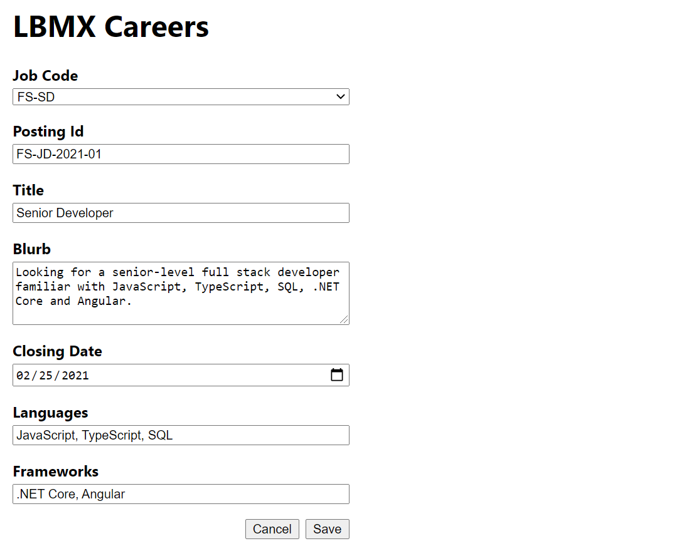
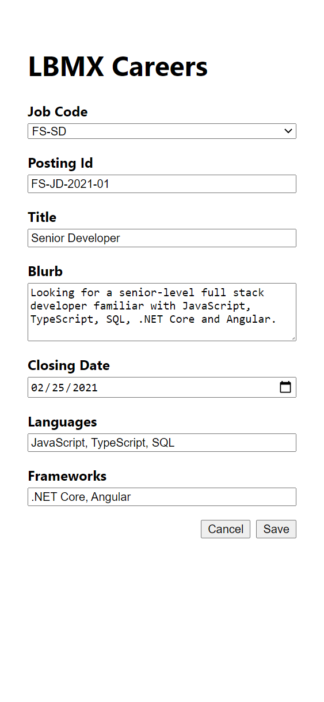

# LBMX Career Coding Exercises

## Prerequisites

- [MongoDB Community Server](https://www.mongodb.com/try/download/community)
- [Nodejs](https://nodejs.org/en/)
- [Git](https://git-scm.com/downloads)
- [LBMX.Careers.API](https://github.com/lbmx/LBMX.Careers.API)
- [LBMX.Careers.Web](https://github.com/lbmx/LBMX.Careers.Web)

Follow the instructions in the LBMX.Careers.API and LBMX.Careers.Web repositories to get the site running on your local machine. Explore the functionality of the site before attempting any of the exercises.

## Overview

The LBMX **Careers** website is split into two projects:

1. LBMX.Careers.API
2. LBMX.Careers.Web

## LBMX.Careers.API

The API server currently supports creating, reviewing and deleting **Postings**.

## Exercises

### Exercise 1

1. Implement a method to allow **Postings** to be updated
1. Allow the use of `postingId` as a route param instead of the MongoDB `_id`
1. Add a string field to the **Posting** model so that a posting can be updated with the employeeId of the successful candidate

Commit your changes with the message: 'exercise 1'

## LBMX.Careers.Web

### Exercise 2

1. Update the web interface to use the `postingId`
1. In **Exercise 1** you created a new field, add a corresponding field to the form

Commit your changes with the message: 'exercise 2'

### Exercise 3

Add styling to App.scss under the form styles comment. Make all changes with CSS do not change any markup.

1. Style the form to look like the _Desktop_ image below
   - Width of the form is 50%
   - Spacing between fields is 16px
   - Spacing between label and input is 4px
   - Spacing between the buttons is 8px
1. Add the styling for mobile as shown in the _Mobile_ image below
   - Width is 100%

Commit your changes with the message: 'exercise 3'

#### Desktop

#### Mobile

## Submission

1. Run the following command in the LBMX.Careers.API: `git format-patch -1`
1. Run the following command in the LBMX.Careers.Web: `git format-patch -2`

This should result in 3 `.patch` files being created. Email these files to the person that sent you this link.
